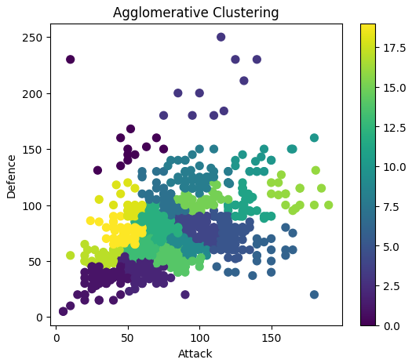
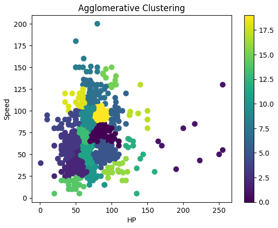

# Pokemon Stats Clustering

This project applies agglomerative clustering to group Pokemon based on their Attack and HP stats.

## Overview

This data science project aims to discover meaningful clusters among Pokemon using their Attack and HP statistics. By employing agglomerative clustering, an unsupervised machine learning technique, we can identify groups of Pokemon with similar characteristics in these two key attributes.

## Features

- Data preprocessing of Pokemon statistics
- Implementation of agglomerative clustering algorithm
- Visualization of clusters using scatter plots
- Analysis of cluster characteristics and compositions

## Dataset (Sources)

The project uses a dataset containing various Pokemon statistics, focusing primarily on the Attack and HP attributes for clustering purposes.
Here's the [Pokemon Stats Dataset](https://drive.google.com/drive/folders/1b8MlRCUHI-9NQ__9VCSu9qJJTjjlKocW?usp=sharing) and [Pokemon Images Dataset](https://drive.google.com/drive/folders/17a1cY3gsQEZilRz00czq6GtanxFHksQV?usp=sharing) from [G-drive Source]. It includes various attributes of Pokemon, with a focus on Attack and HP for this clustering analysis.

## Methodology

1. Data cleaning and normalization
2. Feature selection (Attack and HP)
3. Application of agglomerative clustering
4. Determination of optimal number of clusters
5. Visualization of results
6. Interpretation of cluster meanings

## Requirements

- Python 3.x
- NumPy
- Pandas
- Scikit-learn
- Matplotlib
- Seaborn

## Usage

1. Clone the repository:
    ```bash
    git clone https://github.com/itsmarmot/Pokemon-Clustering.git
    ```
2. Navigate to the project directory:
    ```bash
    cd Pokemon-Clustering
    ```
3. Install the required dependencies:
    ```bash
    pip install -r requirements.txt
    ```
4. Run the project script:
    ```bash
    python cluster_pokemon.py
    ```
<table>
  <tr>
    <td></td>
    <td>The central cluster (green and yellow colors) shows Pokemon with balanced Attack and Defense attributes. Purple clusters might represent Pokemon with lower Attack and Defense. Yellow clusters indicate Pokemon with either high Attack or high Defense but within a specific range, showing a differentiation based on these attributes.</td>
  </tr>
  <tr>
    <td></td>
    <td>The central cluster (green and yellow colors) indicates Pokemon with moderate HP and Speed. Purple and blue clusters represent Pokemon with lower HP and varying Speed. Yellow clusters might indicate high-Speed Pokemon within a certain HP range, suggesting that Speed is a significant differentiating factor within this HP range.</td>
  </tr>
  <tr>

## Future Work (Suggestion)

- Incorporate additional Pokemon attributes for more complex clustering
- Compare results with other clustering algorithms (e.g., K-means, DBSCAN)
- Develop a recommendation system based on cluster analysis

---

Feel free to customize the content as needed!

## Modeling Results
